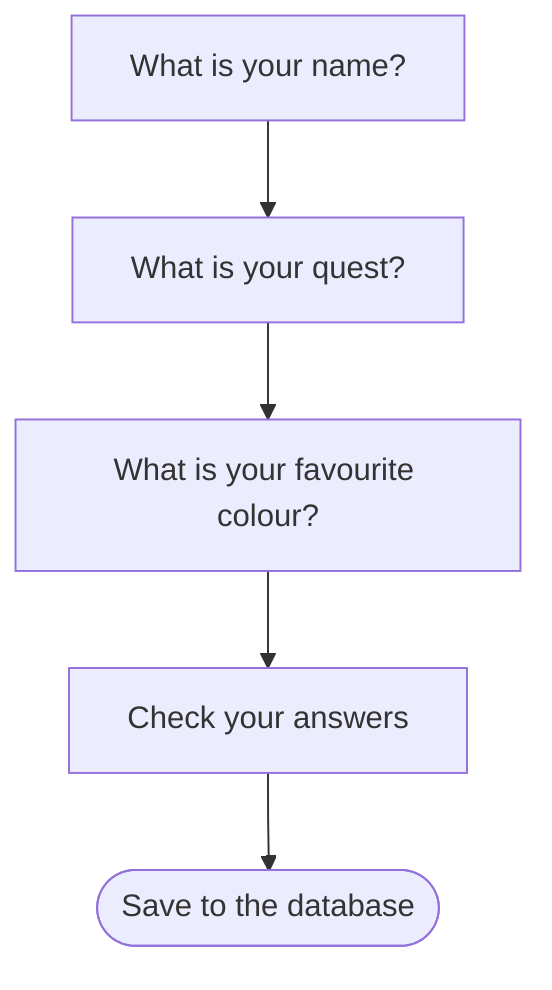
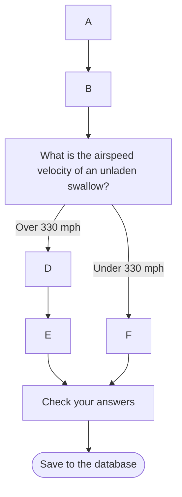

# Journey Framework

The Journey Framework is designed to make creating multi-page form journeys quick and easy without compromising on flexibility.

## Overview

The framework aims to:
- Commonise behaviours of multi-page form journeys without making it difficult to implement custom requirements
- Allow pages and groups of pages to be reused across different journeys
- Separate the structure of journeys from the content to make both easier to maintain and update

## Quick Start

### Creating a New Journey Checklist

1. Create step classes (define pages, validation, and data storage)
2. Define a state interface for your journey
3. Implement a journey state class
4. Define the journey structure using the DSL
5. Add controller methods for GET and POST requests
6. Write tests

### Minimal Journey Example

```kotlin
val simpleJourney = journey(state) {
    step(journey.firstStep) {
        nextStep { journey.secondStep }
        routeSegment("step-1")
        initialStep()
    }
    step(journey.secondStep) {
        nextUrl { "/home" }
        routeSegment("step-2")
        parents { journey.firstStep.isComplete() }
    }
}
```

## Core Concepts

### Graphs and Journey Elements

Journeys are modelled as directed graphs, where nodes are called "Journey Elements" or simply "Elements".
Elements can be steps (pages) or tasks (groups of steps).

A simple linear journey looks like this:



Each edge represents both the transition from one page to the next AND the requirements for a page to be visitable—all previous pages must have been completed.

### Branching Paths

Journeys can have branching paths based on user answers:



For any given answer, the requirements for a page to be visitable are that all previous pages on the path taken must have been completed.

### Parallel Requirements

Sometimes users must complete multiple pages before proceeding, but can visit them in any order:

```mermaid
flowchart TD
A[These questions all need answering] --o B[What is your favourite book?]
B --> C[Who is it by?]
A --o D[How many pets do you have?]
D --X F[Check your answers] --> G([Save to the database])
C --X F
```

### Modes and Outcomes

**Modes** represent the possible answers on a page that affect journey structure. The mode is determined by the user's answer (or external factors), not by direct user selection.

- Modes are specified using an enum class when defining a step
- If the page has not been answered yet, the mode is `null`

**Outcomes** are similar to modes but account for journey structure—they determine reachability. An outcome is the same as the mode if the page is reachable, and `null` otherwise.

## Defining Journey Structure

The journey structure is defined using a Kotlin DSL. For each element, you define:
- Where the user goes when completing the element (for each mode)
- What previous elements must be completed for this element to be visitable (parents)
- Where to redirect if the element is not visitable
- The URL route segment for the element (if applicable)

### Basic Structure

```kotlin
val simpleJourney = journey(state) {
    step(journey.nameStep) {
        nextStep { journey.questStep }
        routeSegment("name")
        initialStep()
    }
    step(journey.questStep) {
        nextStep { journey.colourStep }
        routeSegment("quest")
        parents { journey.nameStep.isComplete() }
    }
    step(journey.colourStep) {
        nextStep { journey.checkAnswersStep }
        routeSegment("colour")
        parents { journey.questStep.isComplete() }
    }
    step(journey.checkAnswersStep) {
        nextUrl { "/home" }
        parents { journey.colourStep.isComplete() }
        routeSegment("check-answers")
    }
}
```

### Branching Based on Mode

```kotlin
step(journey.swallowSpeedStep) {
    nextStep {
        when (it) {
            SwallowSpeed.OVER_330 -> journey.fastSwallowStep
            SwallowSpeed.UNDER_330 -> journey.slowSwallowStep
        }
    }
    routeSegment("swallow-speed")
    parents { journey.nameStep.isComplete() }
}
step(journey.fastSwallowStep) {
    nextStep { journey.checkAnswersStep }
    routeSegment("fast-swallow")
    parents { journey.swallowSpeedStep.hasOutcome(SwallowSpeed.OVER_330) }
}
step(journey.slowSwallowStep) {
    nextStep { journey.checkAnswersStep }
    routeSegment("slow-swallow")
    parents { journey.swallowSpeedStep.hasOutcome(SwallowSpeed.UNDER_330) }
}
```

> **Note:** `nextStep` and `parents` are independent concepts. `nextStep` defines where a user is redirected; `parents` defines when a user can visit a step. It's possible to redirect to an unreachable step.

## Tasks

Tasks are groups of steps that are always completed together with the same internal structure. They allow reuse of step sequences across different journeys.

### Defining a Task

Create a subclass of `Task` and override `makeSubJourney` with the internal structure:

```kotlin
override fun makeSubJourney(state: OccupationState) =
    subJourney(state) {
        step(journey.nameStep) {
            nextStep { journey.dateOfBirthStep }
            routeSegment("name")
            initialStep()
        }
        step(journey.dateOfBirthStep) {
            nextStep {
                when (it) {
                    AgeCategory.MINOR -> journey.parentalConsentStep
                    AgeCategory.ADULT -> journey.addressStep
                }
            }
            routeSegment("date-of-birth")
            parents { journey.nameStep.isComplete() }
        }
        step(journey.parentalConsentStep) {
            nextStep { journey.addressStep }
            routeSegment("parental-consent")
            parents { journey.dateOfBirthStep.hasOutcome(AgeCategory.MINOR) }
        }
        step(journey.addressStep) {
            nextStep { exitStep }
            routeSegment("address")
            parents {
                OrParents(
                    journey.dateOfBirthStep.hasOutcome(AgeCategory.ADULT),
                    journey.parentalConsentStep.isComplete()
                )
            }
        }
        exitStep {
            parents { journey.addressStep.isComplete() }
        }
    }
```

The `exitStep` is an internal step without an associated page. It defines the requirements for completing the task and where to go next.

## Journey State

Each journey has an associated `JourneyState` class that specifies:
- The possible steps and tasks in the journey
- Any additional data to persist between steps

Because each page is a separate HTTP request, the `JourneyState` is stored in the user's session between requests.

### State Interfaces

Define interfaces for tasks and journeys that specify the required steps and data:

```kotlin
interface PersonalDetailsState {
    val nameStep: NameStep
    val dateOfBirthStep: DateOfBirthStep
    // ... other steps and data
}
```

Journey state classes implement these interfaces, ensuring all required data is available.

### The JourneyStateDelegateProvider

Use the `JourneyStateDelegateProvider` to automatically persist properties to the session:

```kotlin
class SimpleJourney(
    override val delegateProvider: JourneyStateDelegateProvider,
    override val nameStep: NameStep,
    override val questStep: QuestStep,
    override val colourStep: ColourStep,
) : JourneyState, SimpleJourneyState {
    var changedMindAboutColour: Boolean? by delegateProvider.nullableDelegate("changedMind")
}
```

The `changedMindAboutColour` property is automatically persisted to the session using the key `"changedMind"`.

### Journey IDs and Metadata

The state is stored in the user's session using a journey ID passed as a query parameter on each request. Journey metadata can allow multiple journey IDs to refer to the same data (e.g., when changing answers from a check-your-answers page).

## Rendering and Form Handling

### Controller Methods

Define at least two controller methods for each journey:
- **GET**: Render pages
- **POST**: Handle form submissions

Each method calls a journey factory to create a map of route segments to [`StepLifecycleOrchestrator`](StepLifecycleOrchestrator.kt) instances, which wrap steps and handle the request lifecycle.

### Step Functions

Step functions are divided into three categories:

**Defined by the step:**
- `getStepSpecificContent()` — provides content for the template
- `chooseTemplate()` — selects which template to render

**Always the same:**
- Validation
- Persisting data to state
- Saving state to the database for session restoration

**Defined by the journey structure:**
- Determining if the step is visitable
- Determining where to redirect if not visitable
- Determining the next step or URL after completion

### Customisation

Override methods on the step class for custom functionality, including final form submission. Most lifecycle functions have `before` and `after` hooks for additional customisation.

