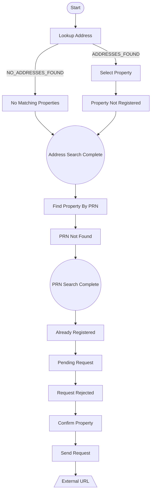

# Join Property

```mermaid
flowchart TD
    __start__([Start]) --> addressSearchTask_lookupAddressStep
    alreadyRegisteredStep[Already Registered]
    pendingRequestStep[Pending Request]
    requestRejectedStep[Request Rejected]
    confirmPropertyStep[Confirm Property]
    sendRequestStep[Send Request]
    addressSearchTask_lookupAddressStep[Lookup Address]
    addressSearchTask_noMatchingPropertiesStep[No Matching Properties]
    addressSearchTask_selectPropertyStep[Select Property]
    addressSearchTask_propertyNotRegisteredStep[Property Not Registered]
    addressSearchTask___exit__((Address Search Complete))
    prnSearchTask_findPropertyByPrnStep[Find Property By PRN]
    prnSearchTask_prnNotFoundStep[PRN Not Found]
    prnSearchTask___exit__((PRN Search Complete))
    alreadyRegisteredStep --> pendingRequestStep
    pendingRequestStep --> requestRejectedStep
    requestRejectedStep --> confirmPropertyStep
    confirmPropertyStep --> sendRequestStep
    __url__sendRequestStep[/External URL\]
    sendRequestStep --> __url__sendRequestStep
    addressSearchTask_lookupAddressStep -->|ADDRESSES_FOUND| addressSearchTask_selectPropertyStep
    addressSearchTask_lookupAddressStep -->|NO_ADDRESSES_FOUND| addressSearchTask_noMatchingPropertiesStep
    addressSearchTask_noMatchingPropertiesStep --> addressSearchTask___exit__
    addressSearchTask_selectPropertyStep --> addressSearchTask_propertyNotRegisteredStep
    addressSearchTask_propertyNotRegisteredStep --> addressSearchTask___exit__
    addressSearchTask___exit__ --> prnSearchTask_findPropertyByPrnStep
    prnSearchTask_findPropertyByPrnStep --> prnSearchTask_prnNotFoundStep
    prnSearchTask_prnNotFoundStep --> prnSearchTask___exit__
    prnSearchTask___exit__ --> alreadyRegisteredStep
```
