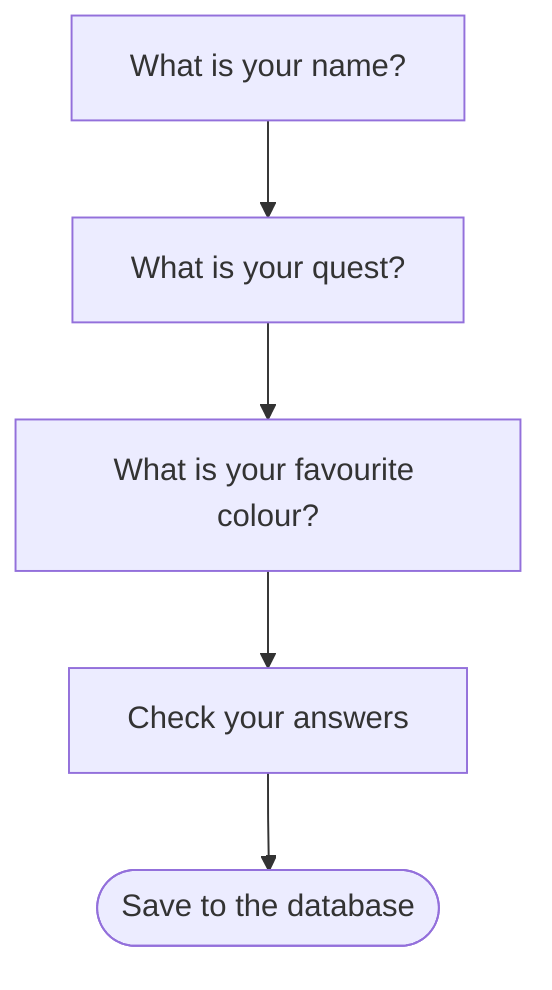
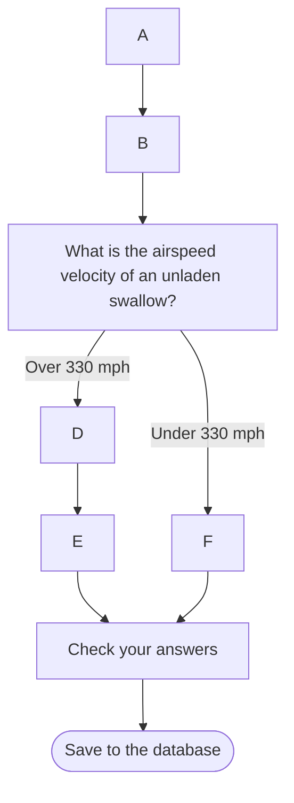
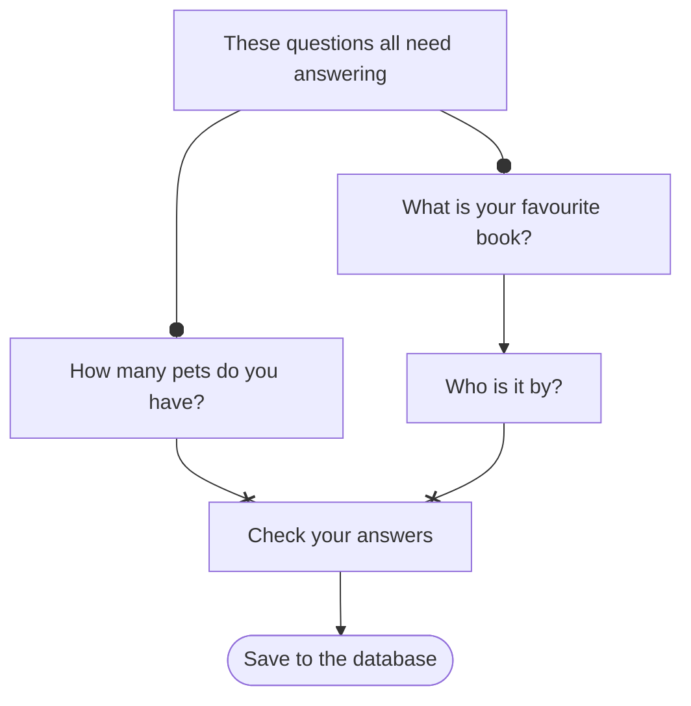
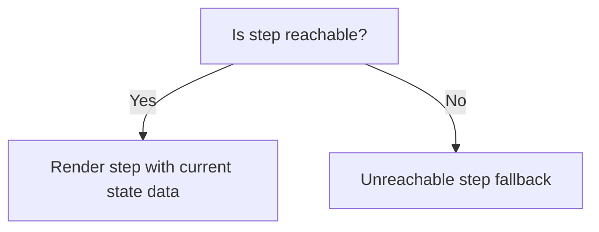
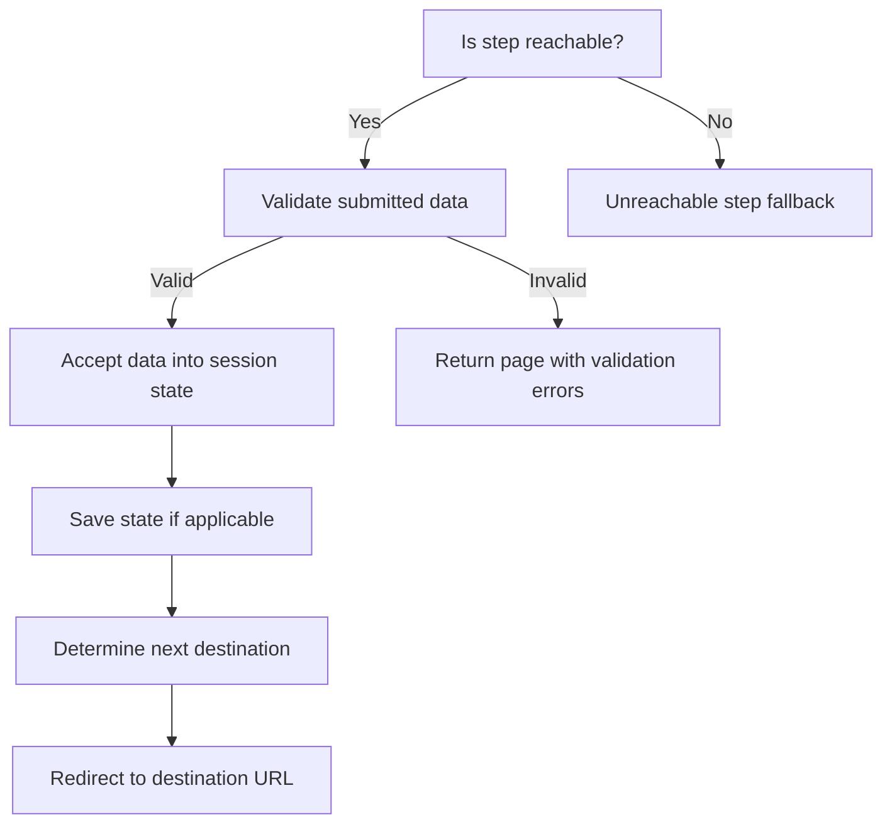
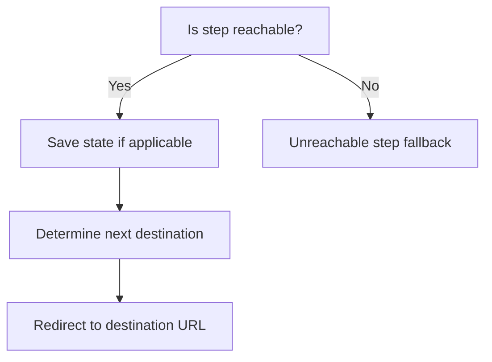

# Understanding the Journey Framework Model
The Journey Framework is designed to create complex multi-page form journeys in a structured and maintainable way.
This document explains the conceptual model used in the framework to represent journeys, pages, and user navigation.

## The Journey as a Directed Graph

### Graphs and Journey Elements

Journeys are modelled as directed graphs, where nodes are called "Journey Elements" or simply "Elements".
Elements can be steps (pages) or tasks (groups of steps).

A simple linear journey made up of single pages looks like this:

In this example, each edge represents both the transition from one page to the next AND the requirements for a page to be visitable—all previous pages must have been completed.
This graph can be understood as the user journey as the user will encounter each question in turn.

### Branching Paths

Journeys can have branching paths based on user answers:

For any given answer, the requirements for a page to be visitable are that all previous pages on the path taken must have been completed.
For the "Check your answers" page to be visitable, either the path through D or F must have been completed.

### Parallel Requirements

Sometimes users must complete multiple pages before proceeding, but can visit them in any order:

In this example, both branches must be completed before proceeding to "Check your answers", but the user can answer them in any order.

### Modes and Outcomes

**Modes** represent the possible answers on a page that affect journey structure. The mode is determined by the user's answer (or external factors), not by direct user selection.

- Modes are specified using an enum class when defining a step
- If the page has not been answered yet, the mode is `null`

**Outcomes** are similar to modes but account for journey structure—they determine reachability. An outcome is the same as the mode if the page is reachable, and `null` otherwise.

### Redirection vs. Reachability
It's important to distinguish between redirection and reachability:
- **Redirection** is defined for each step and determines where the user is sent next after completing a step. This can be based on the mode, but can be any destination regardless of the graph structure.
- **Reachability** is the determining factor for the graph structure and is defined by the completion status of previous steps. A step is reachable if the right combinations of its parent steps have been completed and are themselves reachable.

## Journey Elements
### Steps
Steps are the basic building blocks of a journey and are simplest to think about.
They represent individual pages in the journey where users provide input or view information.
They each have:
* A form model defining the data collected on the page
* A mode enum class defining possible modes for the step
* Logic to determine how the step behaves based on the journey state

The journey structure will define their relationships to other steps and where to redirect after completion.

### Tasks
Tasks are groups of steps that can be reused across different journeys.
They encapsulate a sub-journey with its own internal structure and logic.
They have a common start point and exit point - that is, the journey structure will define when the start can be reached and where can be reached from the exit but internal navigation between them is the responsibility of the task.

As such, they can be thought of as "black boxes" within the larger journey structure, which will define their relationships to other steps and where to redirect after completion.

## Journey State
Because the service is hosted in a web application, the journey is actually a series of HTTP requests and responses.
To maintain continuity, the journey state is stored in the user's session between requests.
The state represents a snapshot of the user's progress through the journey, including:
* What they have submitted for each step so far
* Any derived data needed for journey logic

The state is defined by an interface specific to each journey, which includes properties for each step and task in the journey.
This allows steps to use the journey state to reference other steps and tasks when their relationships and logic are closely coupled.

The Journey State is stored against a journeyId value which is passed as a query parameter on each request.
In some cases this will be an arbitrary value generated when the journey starts, but in others it may be a calculated value such as a hash of entity ID.
In the latter case this allows users to return to an existing journey if they attempt to start a new one for the same entity.

### State Metadata
The users state data is actually stored in the session against a UUID.
The journeyId passed as a query parameter is mapped to this UUID using metadata also stored in the session.
This allows the same state data to be referenced by multiple journeyIds - for example, when changing answers from a check-your-answers page.

### Saving State to the Database
If a journey is "savable", it means that at certain points the data collected in the journey can be persisted to a database so the journey can be resumed in a later session.
The `SavedJourneyState` entry must either:
* be referenced by another entity in the database (e.g. a user profile) to allow explicit resumption or
* the journey id must be calculated from the hash of an entity to allow implicit resumption.

When the journey is saved, the current state is serialized and stored in the database against the relevant entity.

When the journey is loaded, the saved state is retrieved from the database and restored into the user's session.

## Handling HTTP requests

Each journey will be made up of multiple HTTP requests and responses.
Each step will typically correspond to a GET request to display the page and a POST request to submit the form.
In each case an orchestrator will handle the request lifecycle for that request, by calling a group of step functions.
These functions can be defined:
* in the base classes provided by the framework, which implement common behaviours
* in the specific step classes, which implement step-specific behaviours
* by the journey structure, where they define relationships between steps

Specific steps can add custom behaviour by overriding hook functions before and after key lifecycle events.

### Visitable GET Request Lifecycle

### Visitable POST Request Lifecycle

### Redirecting GET Request Lifecycle

