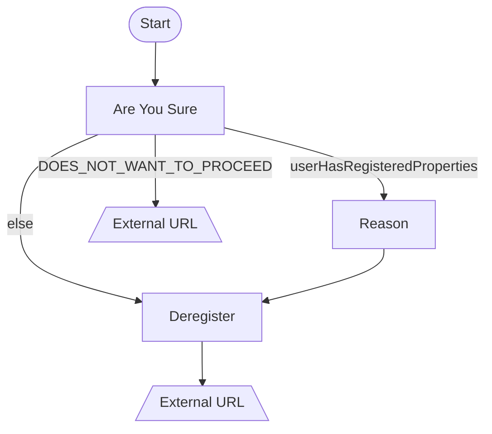

# Landlord Deregistration

```mermaid
flowchart TD
    __start__([Start]) --> areYouSureStep
    areYouSureStep[Are You Sure]
    reasonStep[Reason]
    deregisterStep[Deregister]
    areYouSureStep -->|userHasRegisteredProperties| reasonStep
    areYouSureStep -->|else| deregisterStep
    __url__LANDLORD_DETAILS_FOR_LANDLORD_ROUTE[/External URL\]
    areYouSureStep -->|DOES_NOT_WANT_TO_PROCEED| __url__LANDLORD_DETAILS_FOR_LANDLORD_ROUTE
    reasonStep --> deregisterStep
    __url__deregisterStep[/External URL\]
    deregisterStep --> __url__deregisterStep
```
