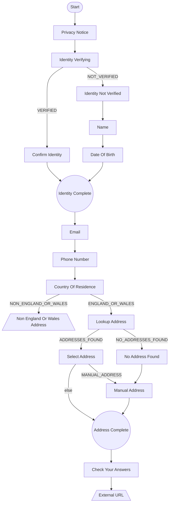

# Landlord Registration

```mermaid
flowchart TD
    __start__([Start]) --> privacyNoticeStep
    privacyNoticeStep[Privacy Notice]
    emailStep[Email]
    phoneNumberStep[Phone Number]
    countryOfResidenceStep[Country Of Residence]
    nonEnglandOrWalesAddressStep[/Non England Or Wales Address\]
    cyaStep[Check Your Answers]
    identityTask_identityVerifyingStep[Identity Verifying]
    identityTask_confirmIdentityStep[Confirm Identity]
    identityTask_identityNotVerifiedStep[Identity Not Verified]
    identityTask_nameStep[Name]
    identityTask_dateOfBirthStep[Date Of Birth]
    identityTask___exit__((Identity Complete))
    addressTask_lookupAddressStep[Lookup Address]
    addressTask_selectAddressStep[Select Address]
    addressTask_noAddressFoundStep[No Address Found]
    addressTask_manualAddressStep[Manual Address]
    addressTask___exit__((Address Complete))
    privacyNoticeStep --> identityTask_identityVerifyingStep
    emailStep --> phoneNumberStep
    phoneNumberStep --> countryOfResidenceStep
    countryOfResidenceStep -->|ENGLAND_OR_WALES| addressTask_lookupAddressStep
    countryOfResidenceStep -->|NON_ENGLAND_OR_WALES| nonEnglandOrWalesAddressStep
    __url__cyaStep[/External URL\]
    cyaStep --> __url__cyaStep
    identityTask_identityVerifyingStep -->|VERIFIED| identityTask_confirmIdentityStep
    identityTask_identityVerifyingStep -->|NOT_VERIFIED| identityTask_identityNotVerifiedStep
    identityTask_confirmIdentityStep --> identityTask___exit__
    identityTask_identityNotVerifiedStep --> identityTask_nameStep
    identityTask_nameStep --> identityTask_dateOfBirthStep
    identityTask_dateOfBirthStep --> identityTask___exit__
    identityTask___exit__ --> emailStep
    addressTask_lookupAddressStep -->|ADDRESSES_FOUND| addressTask_selectAddressStep
    addressTask_lookupAddressStep -->|NO_ADDRESSES_FOUND| addressTask_noAddressFoundStep
    addressTask_selectAddressStep -->|MANUAL_ADDRESS| addressTask_manualAddressStep
    addressTask_selectAddressStep -->|else| addressTask___exit__
    addressTask_noAddressFoundStep --> addressTask_manualAddressStep
    addressTask_manualAddressStep --> addressTask___exit__
    addressTask___exit__ --> cyaStep
```
