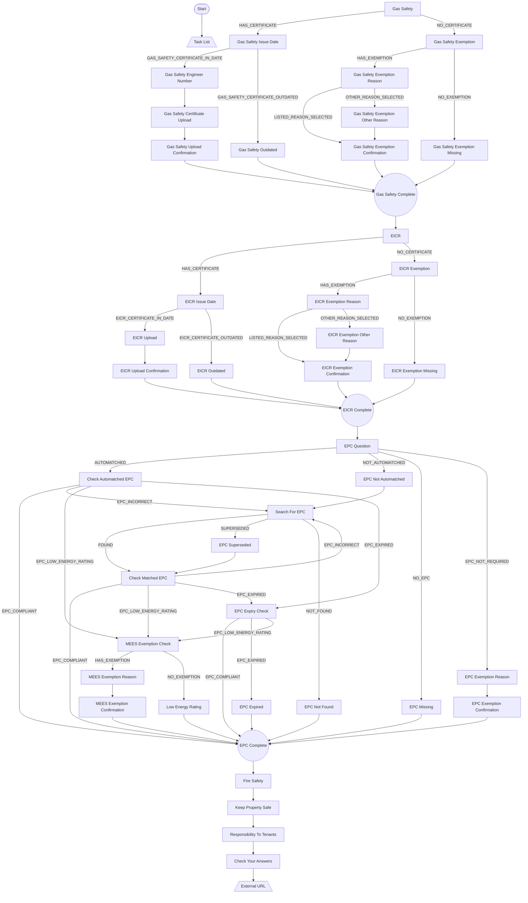

# Property Compliance

```mermaid
flowchart TD
    __start__([Start]) --> taskListStep
    taskListStep[/Task List\]
    fireSafetyStep[Fire Safety]
    keepPropertySafeStep[Keep Property Safe]
    responsibilityToTenantsStep[Responsibility To Tenants]
    cyaStep[Check Your Answers]
    gasSafetyTask_gasSafetyStep[Gas Safety]
    gasSafetyTask_gasSafetyIssueDateStep[Gas Safety Issue Date]
    gasSafetyTask_gasSafetyEngineerNumberStep[Gas Safety Engineer Number]
    gasSafetyTask_gasSafetyCertificateUploadStep[Gas Safety Certificate Upload]
    gasSafetyTask_gasSafetyUploadConfirmationStep[Gas Safety Upload Confirmation]
    gasSafetyTask_gasSafetyOutdatedStep[Gas Safety Outdated]
    gasSafetyTask_gasSafetyExemptionStep[Gas Safety Exemption]
    gasSafetyTask_gasSafetyExemptionReasonStep[Gas Safety Exemption Reason]
    gasSafetyTask_gasSafetyExemptionOtherReasonStep[Gas Safety Exemption Other Reason]
    gasSafetyTask_gasSafetyExemptionConfirmationStep[Gas Safety Exemption Confirmation]
    gasSafetyTask_gasSafetyExemptionMissingStep[Gas Safety Exemption Missing]
    gasSafetyTask___exit__((Gas Safety Complete))
    eicrTask_eicrStep[EICR]
    eicrTask_eicrIssueDateStep[EICR Issue Date]
    eicrTask_eicrUploadStep[EICR Upload]
    eicrTask_eicrUploadConfirmationStep[EICR Upload Confirmation]
    eicrTask_eicrOutdatedStep[EICR Outdated]
    eicrTask_eicrExemptionStep[EICR Exemption]
    eicrTask_eicrExemptionReasonStep[EICR Exemption Reason]
    eicrTask_eicrExemptionOtherReasonStep[EICR Exemption Other Reason]
    eicrTask_eicrExemptionConfirmationStep[EICR Exemption Confirmation]
    eicrTask_eicrExemptionMissingStep[EICR Exemption Missing]
    eicrTask___exit__((EICR Complete))
    epcTask_epcQuestionStep[EPC Question]
    epcTask_checkAutomatchedEpcStep[Check Automatched EPC]
    epcTask_epcNotAutomatchedStep[EPC Not Automatched]
    epcTask_searchForEpcStep[Search For EPC]
    epcTask_epcSupersededStep[EPC Superseded]
    epcTask_checkMatchedEpcStep[Check Matched EPC]
    epcTask_epcNotFoundStep[EPC Not Found]
    epcTask_epcMissingStep[EPC Missing]
    epcTask_epcExemptionReasonStep[EPC Exemption Reason]
    epcTask_epcExemptionConfirmationStep[EPC Exemption Confirmation]
    epcTask_epcExpiryCheckStep[EPC Expiry Check]
    epcTask_epcExpiredStep[EPC Expired]
    epcTask_meesExemptionCheckStep[MEES Exemption Check]
    epcTask_meesExemptionReasonStep[MEES Exemption Reason]
    epcTask_meesExemptionConfirmationStep[MEES Exemption Confirmation]
    epcTask_lowEnergyRatingStep[Low Energy Rating]
    epcTask___exit__((EPC Complete))
    fireSafetyStep --> keepPropertySafeStep
    keepPropertySafeStep --> responsibilityToTenantsStep
    responsibilityToTenantsStep --> cyaStep
    __url__cyaStep[/External URL\]
    cyaStep --> __url__cyaStep
    gasSafetyTask_gasSafetyStep -->|HAS_CERTIFICATE| gasSafetyTask_gasSafetyIssueDateStep
    gasSafetyTask_gasSafetyStep -->|NO_CERTIFICATE| gasSafetyTask_gasSafetyExemptionStep
    gasSafetyTask_gasSafetyIssueDateStep -->|GAS_SAFETY_CERTIFICATE_IN_DATE| gasSafetyTask_gasSafetyEngineerNumberStep
    gasSafetyTask_gasSafetyIssueDateStep -->|GAS_SAFETY_CERTIFICATE_OUTDATED| gasSafetyTask_gasSafetyOutdatedStep
    gasSafetyTask_gasSafetyEngineerNumberStep --> gasSafetyTask_gasSafetyCertificateUploadStep
    gasSafetyTask_gasSafetyCertificateUploadStep --> gasSafetyTask_gasSafetyUploadConfirmationStep
    gasSafetyTask_gasSafetyUploadConfirmationStep --> gasSafetyTask___exit__
    gasSafetyTask_gasSafetyOutdatedStep --> gasSafetyTask___exit__
    gasSafetyTask_gasSafetyExemptionStep -->|HAS_EXEMPTION| gasSafetyTask_gasSafetyExemptionReasonStep
    gasSafetyTask_gasSafetyExemptionStep -->|NO_EXEMPTION| gasSafetyTask_gasSafetyExemptionMissingStep
    gasSafetyTask_gasSafetyExemptionReasonStep -->|LISTED_REASON_SELECTED| gasSafetyTask_gasSafetyExemptionConfirmationStep
    gasSafetyTask_gasSafetyExemptionReasonStep -->|OTHER_REASON_SELECTED| gasSafetyTask_gasSafetyExemptionOtherReasonStep
    gasSafetyTask_gasSafetyExemptionOtherReasonStep --> gasSafetyTask_gasSafetyExemptionConfirmationStep
    gasSafetyTask_gasSafetyExemptionConfirmationStep --> gasSafetyTask___exit__
    gasSafetyTask_gasSafetyExemptionMissingStep --> gasSafetyTask___exit__
    gasSafetyTask___exit__ --> eicrTask_eicrStep
    eicrTask_eicrStep -->|HAS_CERTIFICATE| eicrTask_eicrIssueDateStep
    eicrTask_eicrStep -->|NO_CERTIFICATE| eicrTask_eicrExemptionStep
    eicrTask_eicrIssueDateStep -->|EICR_CERTIFICATE_IN_DATE| eicrTask_eicrUploadStep
    eicrTask_eicrIssueDateStep -->|EICR_CERTIFICATE_OUTDATED| eicrTask_eicrOutdatedStep
    eicrTask_eicrUploadStep --> eicrTask_eicrUploadConfirmationStep
    eicrTask_eicrUploadConfirmationStep --> eicrTask___exit__
    eicrTask_eicrOutdatedStep --> eicrTask___exit__
    eicrTask_eicrExemptionStep -->|HAS_EXEMPTION| eicrTask_eicrExemptionReasonStep
    eicrTask_eicrExemptionStep -->|NO_EXEMPTION| eicrTask_eicrExemptionMissingStep
    eicrTask_eicrExemptionReasonStep -->|LISTED_REASON_SELECTED| eicrTask_eicrExemptionConfirmationStep
    eicrTask_eicrExemptionReasonStep -->|OTHER_REASON_SELECTED| eicrTask_eicrExemptionOtherReasonStep
    eicrTask_eicrExemptionOtherReasonStep --> eicrTask_eicrExemptionConfirmationStep
    eicrTask_eicrExemptionConfirmationStep --> eicrTask___exit__
    eicrTask_eicrExemptionMissingStep --> eicrTask___exit__
    eicrTask___exit__ --> epcTask_epcQuestionStep
    epcTask_epcQuestionStep -->|AUTOMATCHED| epcTask_checkAutomatchedEpcStep
    epcTask_epcQuestionStep -->|NOT_AUTOMATCHED| epcTask_epcNotAutomatchedStep
    epcTask_epcQuestionStep -->|NO_EPC| epcTask_epcMissingStep
    epcTask_epcQuestionStep -->|EPC_NOT_REQUIRED| epcTask_epcExemptionReasonStep
    epcTask_checkAutomatchedEpcStep -->|EPC_COMPLIANT| epcTask___exit__
    epcTask_checkAutomatchedEpcStep -->|EPC_INCORRECT| epcTask_searchForEpcStep
    epcTask_checkAutomatchedEpcStep -->|EPC_LOW_ENERGY_RATING| epcTask_meesExemptionCheckStep
    epcTask_checkAutomatchedEpcStep -->|EPC_EXPIRED| epcTask_epcExpiryCheckStep
    epcTask_epcNotAutomatchedStep --> epcTask_searchForEpcStep
    epcTask_searchForEpcStep -->|FOUND| epcTask_checkMatchedEpcStep
    epcTask_searchForEpcStep -->|SUPERSEDED| epcTask_epcSupersededStep
    epcTask_searchForEpcStep -->|NOT_FOUND| epcTask_epcNotFoundStep
    epcTask_epcSupersededStep --> epcTask_checkMatchedEpcStep
    epcTask_checkMatchedEpcStep -->|EPC_COMPLIANT| epcTask___exit__
    epcTask_checkMatchedEpcStep -->|EPC_INCORRECT| epcTask_searchForEpcStep
    epcTask_checkMatchedEpcStep -->|EPC_LOW_ENERGY_RATING| epcTask_meesExemptionCheckStep
    epcTask_checkMatchedEpcStep -->|EPC_EXPIRED| epcTask_epcExpiryCheckStep
    epcTask_epcNotFoundStep --> epcTask___exit__
    epcTask_epcMissingStep --> epcTask___exit__
    epcTask_epcExemptionReasonStep --> epcTask_epcExemptionConfirmationStep
    epcTask_epcExemptionConfirmationStep --> epcTask___exit__
    epcTask_epcExpiryCheckStep -->|EPC_COMPLIANT| epcTask___exit__
    epcTask_epcExpiryCheckStep -->|EPC_EXPIRED| epcTask_epcExpiredStep
    epcTask_epcExpiryCheckStep -->|EPC_LOW_ENERGY_RATING| epcTask_meesExemptionCheckStep
    epcTask_epcExpiredStep --> epcTask___exit__
    epcTask_meesExemptionCheckStep -->|HAS_EXEMPTION| epcTask_meesExemptionReasonStep
    epcTask_meesExemptionCheckStep -->|NO_EXEMPTION| epcTask_lowEnergyRatingStep
    epcTask_meesExemptionReasonStep --> epcTask_meesExemptionConfirmationStep
    epcTask_meesExemptionConfirmationStep --> epcTask___exit__
    epcTask_lowEnergyRatingStep --> epcTask___exit__
    epcTask___exit__ --> fireSafetyStep
```
