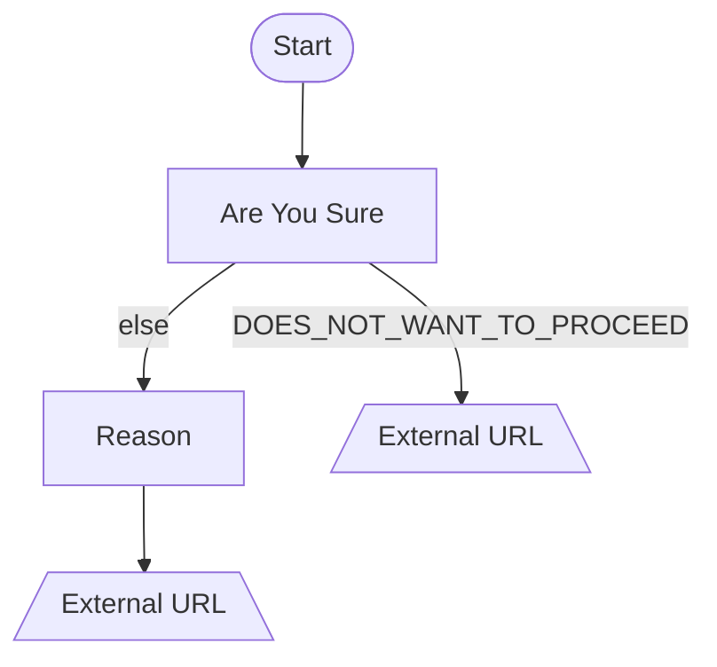

# Property Deregistration

```mermaid
flowchart TD
    __start__([Start]) --> areYouSureStep
    areYouSureStep[Are You Sure]
    reasonStep[Reason]
    areYouSureStep -->|else| reasonStep
    __url__PropertyDetailsController_getPropertyDetailsPathpropertyOwnershipId[/External URL\]
    areYouSureStep -->|DOES_NOT_WANT_TO_PROCEED| __url__PropertyDetailsController_getPropertyDetailsPathpropertyOwnershipId
    __url__reasonStep[/External URL\]
    reasonStep --> __url__reasonStep
```
