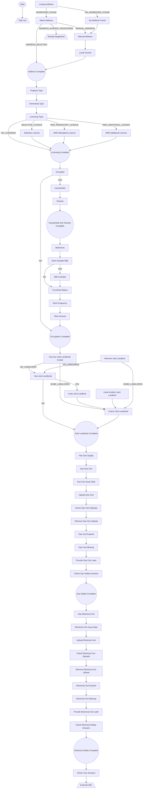

# Property Registration

```mermaid
flowchart TD
    __start__([Start]) --> taskListStep
    taskListStep[/Task List\]
    propertyTypeStep[Property Type]
    ownershipTypeStep[Ownership Type]
    cyaStep[Check Your Answers]
    addressTask_lookupAddressStep[Lookup Address]
    addressTask_selectAddressStep[Select Address]
    addressTask_noAddressFoundStep[No Address Found]
    addressTask_manualAddressStep[Manual Address]
    addressTask_alreadyRegisteredStep[/Already Registered\]
    addressTask_localCouncilStep[Local Council]
    addressTask___exit__((Address Complete))
    licensingTask_licensingTypeStep[Licensing Type]
    licensingTask_selectiveLicenceStep[Selective Licence]
    licensingTask_hmoMandatoryLicenceStep[HMO Mandatory Licence]
    licensingTask_hmoAdditionalLicenceStep[HMO Additional Licence]
    licensingTask___exit__((Licensing Complete))
    occupationTask_occupied[Occupied]
    occupationTask_bedrooms[Bedrooms]
    occupationTask_rentIncludesBills[Rent Includes Bills]
    occupationTask_billsIncluded[Bills Included]
    occupationTask_furnishedStatus[Furnished Status]
    occupationTask_rentFrequency[Rent Frequency]
    occupationTask_rentAmount[Rent Amount]
    occupationTask_householdsAndTenantsTask_households[Households]
    occupationTask_householdsAndTenantsTask_tenants[Tenants]
    occupationTask_householdsAndTenantsTask___exit__((Households And Tenants Complete))
    occupationTask___exit__((Occupation Complete))
    jointLandlordsTask_hasAnyJointLandlordsInvitedStep[Has Any Joint Landlords Invited]
    jointLandlordsTask_hasJointLandlordsStep[Has Joint Landlords]
    jointLandlordsTask_inviteJointLandlordStep[Invite Joint Landlord]
    jointLandlordsTask_checkJointLandlordsStep[Check Joint Landlords]
    jointLandlordsTask_inviteAnotherJointLandlordStep[Invite Another Joint Landlord]
    jointLandlordsTask_removeJointLandlordStep[Remove Joint Landlord]
    jointLandlordsTask___exit__((Joint Landlords Complete))
    gasSafetyTask_hasGasSupplyStep[Has Gas Supply]
    gasSafetyTask_hasGasCertStep[Has Gas Cert]
    gasSafetyTask_gasCertIssueDateStep[Gas Cert Issue Date]
    gasSafetyTask_uploadGasCertStep[Upload Gas Cert]
    gasSafetyTask_checkGasCertUploadsStep[Check Gas Cert Uploads]
    gasSafetyTask_removeGasCertUploadStep[Remove Gas Cert Upload]
    gasSafetyTask_gasCertExpiredStep[Gas Cert Expired]
    gasSafetyTask_gasCertMissingStep[Gas Cert Missing]
    gasSafetyTask_provideGasCertLaterStep[Provide Gas Cert Later]
    gasSafetyTask_checkGasSafetyAnswersStep[Check Gas Safety Answers]
    gasSafetyTask___exit__((Gas Safety Complete))
    electricalSafetyTask_hasElectricalCertStep[Has Electrical Cert]
    electricalSafetyTask_electricalCertIssueDateStep[Electrical Cert Issue Date]
    electricalSafetyTask_uploadElectricalCertStep[Upload Electrical Cert]
    electricalSafetyTask_checkElectricalCertUploadsStep[Check Electrical Cert Uploads]
    electricalSafetyTask_removeElectricalCertUploadStep[Remove Electrical Cert Upload]
    electricalSafetyTask_electricalCertExpiredStep[Electrical Cert Expired]
    electricalSafetyTask_electricalCertMissingStep[Electrical Cert Missing]
    electricalSafetyTask_provideElectricalCertLaterStep[Provide Electrical Cert Later]
    electricalSafetyTask_checkElectricalSafetyAnswersStep[Check Electrical Safety Answers]
    electricalSafetyTask___exit__((Electrical Safety Complete))
    propertyTypeStep --> ownershipTypeStep
    ownershipTypeStep --> licensingTask_licensingTypeStep
    __url__cyaStep[/External URL\]
    cyaStep --> __url__cyaStep
    addressTask_lookupAddressStep -->|ADDRESSES_FOUND| addressTask_selectAddressStep
    addressTask_lookupAddressStep -->|NO_ADDRESSES_FOUND| addressTask_noAddressFoundStep
    addressTask_selectAddressStep -->|MANUAL_ADDRESS| addressTask_manualAddressStep
    addressTask_selectAddressStep -->|ADDRESS_ALREADY_REGISTERED| addressTask_alreadyRegisteredStep
    addressTask_selectAddressStep -->|ADDRESS_SELECTED| addressTask___exit__
    addressTask_noAddressFoundStep --> addressTask_manualAddressStep
    addressTask_manualAddressStep --> addressTask_localCouncilStep
    addressTask_localCouncilStep --> addressTask___exit__
    addressTask___exit__ --> propertyTypeStep
    licensingTask_licensingTypeStep -->|SELECTIVE_LICENCE| licensingTask_selectiveLicenceStep
    licensingTask_licensingTypeStep -->|HMO_MANDATORY_LICENCE| licensingTask_hmoMandatoryLicenceStep
    licensingTask_licensingTypeStep -->|HMO_ADDITIONAL_LICENCE| licensingTask_hmoAdditionalLicenceStep
    licensingTask_licensingTypeStep -->|NO_LICENSING| licensingTask___exit__
    licensingTask_selectiveLicenceStep --> licensingTask___exit__
    licensingTask_hmoMandatoryLicenceStep --> licensingTask___exit__
    licensingTask_hmoAdditionalLicenceStep --> licensingTask___exit__
    licensingTask___exit__ --> occupationTask_occupied
    occupationTask_occupied -->|YES| occupationTask_householdsAndTenantsTask_households
    occupationTask_occupied -->|NO| occupationTask___exit__
    occupationTask_bedrooms --> occupationTask_rentIncludesBills
    occupationTask_rentIncludesBills -->|YES| occupationTask_billsIncluded
    occupationTask_rentIncludesBills -->|NO| occupationTask_furnishedStatus
    occupationTask_billsIncluded --> occupationTask_furnishedStatus
    occupationTask_furnishedStatus --> occupationTask_rentFrequency
    occupationTask_rentFrequency --> occupationTask_rentAmount
    occupationTask_rentAmount --> occupationTask___exit__
    occupationTask_householdsAndTenantsTask_households --> occupationTask_householdsAndTenantsTask_tenants
    occupationTask_householdsAndTenantsTask_tenants --> occupationTask_householdsAndTenantsTask___exit__
    occupationTask_householdsAndTenantsTask___exit__ --> occupationTask_bedrooms
    occupationTask___exit__ --> jointLandlordsTask_hasAnyJointLandlordsInvitedStep
    jointLandlordsTask_hasAnyJointLandlordsInvitedStep -->|NO_LANDLORDS| jointLandlordsTask_hasJointLandlordsStep
    jointLandlordsTask_hasAnyJointLandlordsInvitedStep -->|SOME_LANDLORDS| jointLandlordsTask_checkJointLandlordsStep
    jointLandlordsTask_hasJointLandlordsStep -->|YES| jointLandlordsTask_inviteJointLandlordStep
    jointLandlordsTask_hasJointLandlordsStep -->|NO| jointLandlordsTask___exit__
    jointLandlordsTask_inviteJointLandlordStep --> jointLandlordsTask_checkJointLandlordsStep
    jointLandlordsTask_checkJointLandlordsStep --> jointLandlordsTask___exit__
    jointLandlordsTask_inviteAnotherJointLandlordStep --> jointLandlordsTask_checkJointLandlordsStep
    jointLandlordsTask_removeJointLandlordStep -->|SOME_LANDLORDS| jointLandlordsTask_checkJointLandlordsStep
    jointLandlordsTask_removeJointLandlordStep -->|NO_LANDLORDS| jointLandlordsTask_hasJointLandlordsStep
    jointLandlordsTask___exit__ --> gasSafetyTask_hasGasSupplyStep
    gasSafetyTask_hasGasSupplyStep --> gasSafetyTask_hasGasCertStep
    gasSafetyTask_hasGasCertStep --> gasSafetyTask_gasCertIssueDateStep
    gasSafetyTask_gasCertIssueDateStep --> gasSafetyTask_uploadGasCertStep
    gasSafetyTask_uploadGasCertStep --> gasSafetyTask_checkGasCertUploadsStep
    gasSafetyTask_checkGasCertUploadsStep --> gasSafetyTask_removeGasCertUploadStep
    gasSafetyTask_removeGasCertUploadStep --> gasSafetyTask_gasCertExpiredStep
    gasSafetyTask_gasCertExpiredStep --> gasSafetyTask_gasCertMissingStep
    gasSafetyTask_gasCertMissingStep --> gasSafetyTask_provideGasCertLaterStep
    gasSafetyTask_provideGasCertLaterStep --> gasSafetyTask_checkGasSafetyAnswersStep
    gasSafetyTask_checkGasSafetyAnswersStep --> gasSafetyTask___exit__
    gasSafetyTask___exit__ --> electricalSafetyTask_hasElectricalCertStep
    electricalSafetyTask_hasElectricalCertStep --> electricalSafetyTask_electricalCertIssueDateStep
    electricalSafetyTask_electricalCertIssueDateStep --> electricalSafetyTask_uploadElectricalCertStep
    electricalSafetyTask_uploadElectricalCertStep --> electricalSafetyTask_checkElectricalCertUploadsStep
    electricalSafetyTask_checkElectricalCertUploadsStep --> electricalSafetyTask_removeElectricalCertUploadStep
    electricalSafetyTask_removeElectricalCertUploadStep --> electricalSafetyTask_electricalCertExpiredStep
    electricalSafetyTask_electricalCertExpiredStep --> electricalSafetyTask_electricalCertMissingStep
    electricalSafetyTask_electricalCertMissingStep --> electricalSafetyTask_provideElectricalCertLaterStep
    electricalSafetyTask_provideElectricalCertLaterStep --> electricalSafetyTask_checkElectricalSafetyAnswersStep
    electricalSafetyTask_checkElectricalSafetyAnswersStep --> electricalSafetyTask___exit__
    electricalSafetyTask___exit__ --> cyaStep
```
