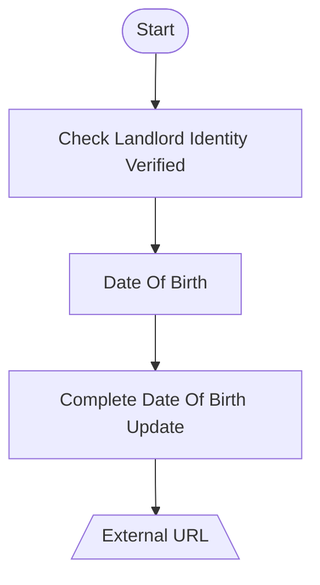

# Update Date Of Birth

```mermaid
flowchart TD
    __start__([Start]) --> checkLandlordIdentityVerifiedStep
    checkLandlordIdentityVerifiedStep[Check Landlord Identity Verified]
    dateOfBirthStep[Date Of Birth]
    completeDateOfBirthUpdateStep[Complete Date Of Birth Update]
    checkLandlordIdentityVerifiedStep --> dateOfBirthStep
    dateOfBirthStep --> completeDateOfBirthUpdateStep
    __url__completeDateOfBirthUpdateStep[/External URL\]
    completeDateOfBirthUpdateStep --> __url__completeDateOfBirthUpdateStep
```
