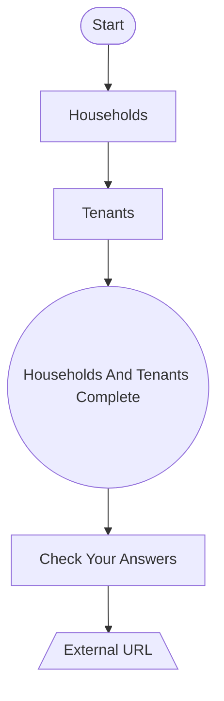

# Update Households And Tenants

```mermaid
flowchart TD
    __start__([Start]) --> householdsAndTenantsTask_households
    cyaStep[Check Your Answers]
    householdsAndTenantsTask_households[Households]
    householdsAndTenantsTask_tenants[Tenants]
    householdsAndTenantsTask___exit__((Households And Tenants Complete))
    __url__cyaStep[/External URL\]
    cyaStep --> __url__cyaStep
    householdsAndTenantsTask_households --> householdsAndTenantsTask_tenants
    householdsAndTenantsTask_tenants --> householdsAndTenantsTask___exit__
    householdsAndTenantsTask___exit__ --> cyaStep
```
