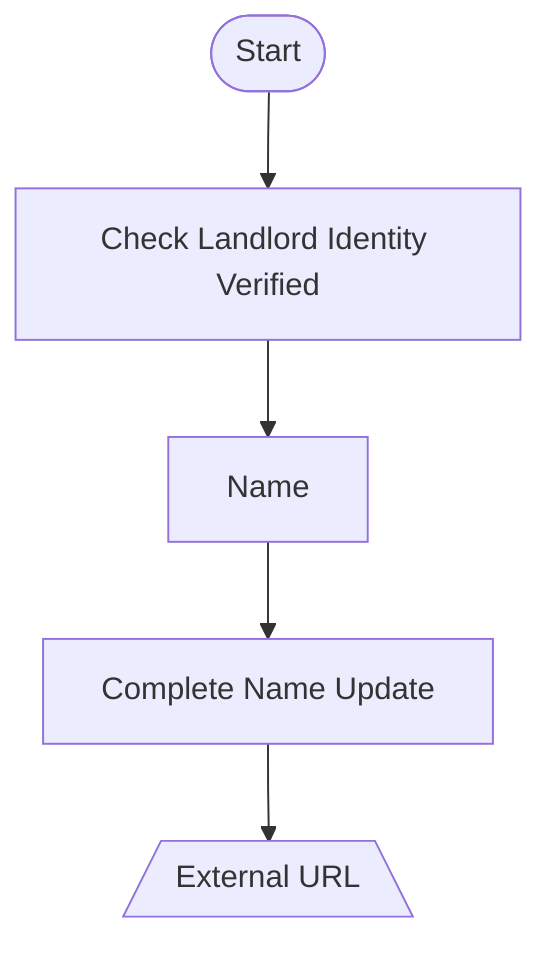

# Update Name

```mermaid
flowchart TD
    __start__([Start]) --> checkLandlordIdentityVerifiedStep
    checkLandlordIdentityVerifiedStep[Check Landlord Identity Verified]
    nameStep[Name]
    completeNameUpdateStep[Complete Name Update]
    checkLandlordIdentityVerifiedStep --> nameStep
    nameStep --> completeNameUpdateStep
    __url__completeNameUpdateStep[/External URL\]
    completeNameUpdateStep --> __url__completeNameUpdateStep
```
