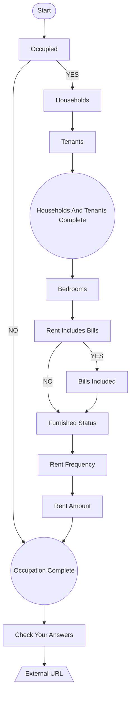

# Update Occupancy

```mermaid
flowchart TD
    __start__([Start]) --> occupationTask_occupied
    cyaStep[Check Your Answers]
    occupationTask_occupied[Occupied]
    occupationTask_bedrooms[Bedrooms]
    occupationTask_rentIncludesBills[Rent Includes Bills]
    occupationTask_billsIncluded[Bills Included]
    occupationTask_furnishedStatus[Furnished Status]
    occupationTask_rentFrequency[Rent Frequency]
    occupationTask_rentAmount[Rent Amount]
    occupationTask_householdsAndTenantsTask_households[Households]
    occupationTask_householdsAndTenantsTask_tenants[Tenants]
    occupationTask_householdsAndTenantsTask___exit__((Households And Tenants Complete))
    occupationTask___exit__((Occupation Complete))
    __url__cyaStep[/External URL\]
    cyaStep --> __url__cyaStep
    occupationTask_occupied -->|YES| occupationTask_householdsAndTenantsTask_households
    occupationTask_occupied -->|NO| occupationTask___exit__
    occupationTask_bedrooms --> occupationTask_rentIncludesBills
    occupationTask_rentIncludesBills -->|YES| occupationTask_billsIncluded
    occupationTask_rentIncludesBills -->|NO| occupationTask_furnishedStatus
    occupationTask_billsIncluded --> occupationTask_furnishedStatus
    occupationTask_furnishedStatus --> occupationTask_rentFrequency
    occupationTask_rentFrequency --> occupationTask_rentAmount
    occupationTask_rentAmount --> occupationTask___exit__
    occupationTask_householdsAndTenantsTask_households --> occupationTask_householdsAndTenantsTask_tenants
    occupationTask_householdsAndTenantsTask_tenants --> occupationTask_householdsAndTenantsTask___exit__
    occupationTask_householdsAndTenantsTask___exit__ --> occupationTask_bedrooms
    occupationTask___exit__ --> cyaStep
```
