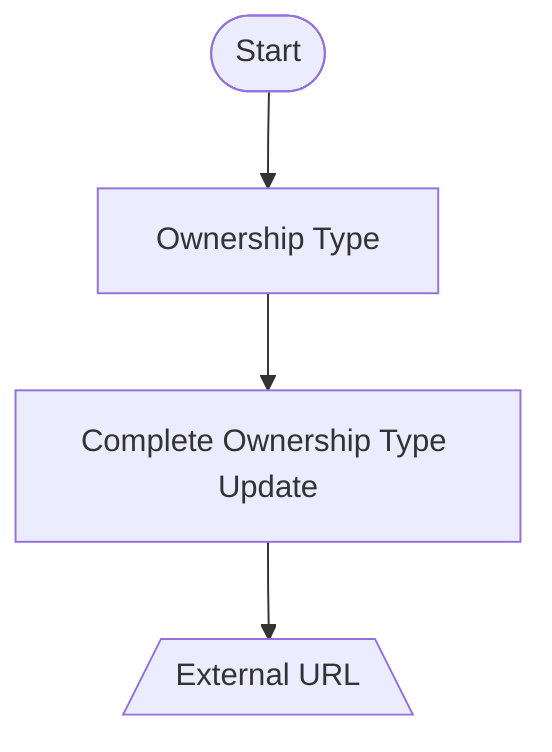

# Update Ownership Type

```mermaid
flowchart TD
    __start__([Start]) --> ownershipTypeStep
    ownershipTypeStep[Ownership Type]
    completeOwnershipTypeUpdateStep[Complete Ownership Type Update]
    ownershipTypeStep --> completeOwnershipTypeUpdateStep
    __url__completeOwnershipTypeUpdateStep[/External URL\]
    completeOwnershipTypeUpdateStep --> __url__completeOwnershipTypeUpdateStep
```
