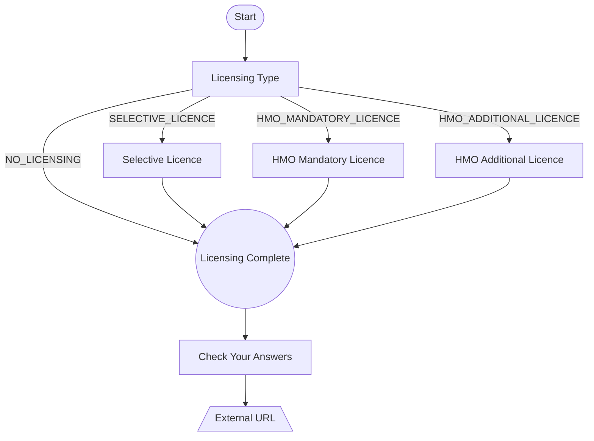

# Update Property Licensing

```mermaid
flowchart TD
    __start__([Start]) --> licensingTask_licensingTypeStep
    cyaStep[Check Your Answers]
    licensingTask_licensingTypeStep[Licensing Type]
    licensingTask_selectiveLicenceStep[Selective Licence]
    licensingTask_hmoMandatoryLicenceStep[HMO Mandatory Licence]
    licensingTask_hmoAdditionalLicenceStep[HMO Additional Licence]
    licensingTask___exit__((Licensing Complete))
    __url__cyaStep[/External URL\]
    cyaStep --> __url__cyaStep
    licensingTask_licensingTypeStep -->|SELECTIVE_LICENCE| licensingTask_selectiveLicenceStep
    licensingTask_licensingTypeStep -->|HMO_MANDATORY_LICENCE| licensingTask_hmoMandatoryLicenceStep
    licensingTask_licensingTypeStep -->|HMO_ADDITIONAL_LICENCE| licensingTask_hmoAdditionalLicenceStep
    licensingTask_licensingTypeStep -->|NO_LICENSING| licensingTask___exit__
    licensingTask_selectiveLicenceStep --> licensingTask___exit__
    licensingTask_hmoMandatoryLicenceStep --> licensingTask___exit__
    licensingTask_hmoAdditionalLicenceStep --> licensingTask___exit__
    licensingTask___exit__ --> cyaStep
```
