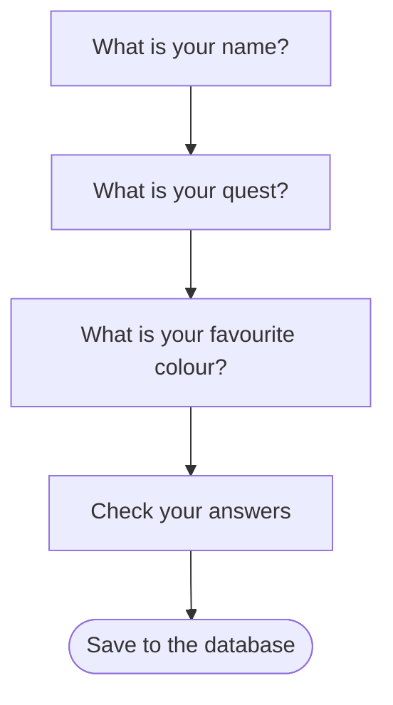
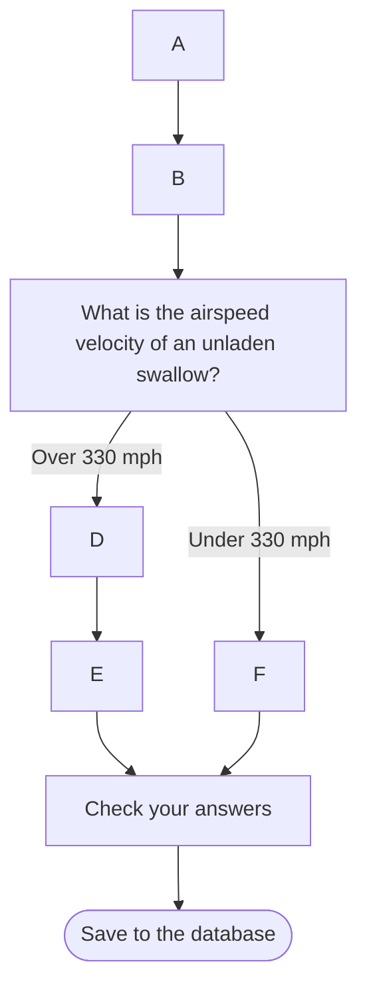

# The Journey Framework documentation interview

## What is the Journey Framework for?

The Journey Framework is designed to make creating multi-page form journeys quick and easy without compromising on flexibility.
We want to commonise the behaviours of multi-page form journeys without making it difficult to implement custom requirements.
We want to allow pages and groups of pages to be reused across different journeys.
We want to separate the structure of the journeys from the content of the journeys to make it easier to maintain and update both.

## Ok, so how does it work?
### Graphs and Journey Elements
We think about journeys as directed graphs, where we refer to nodes in the graph as "Journey Elements" or just "Elements".
A very simple example is shown below, with each element as a page in the journey:
In this example each edge represents the transition from one page to the next AND the requirements for a page to visitable - all previous pages must have been completed.



We can have more complex journeys with branching paths, for example:

In this example, the path taken through the journey depends on the answer given to the question on page C.
If the user answers "Over 330 mph" they will go to page D next, otherwise they will go to page F.
For any given answer, the requirements for a page to be visitable are that all previous pages on the path taken must have been completed.



There is a different kind of branching that can occur too, where the user can visit one of several pages based on their answers, but all pages must be completed before moving on.
For example:
In this example, the user must answer both questions B and D before moving on to the check your answers page, but can proceed to either B or D from A.

```mermaid
flowchart TD
A[These questions all need answering] --o B[What is your favourite book?]
B --> C[Who is it by?]
A --o D[How many pets do you have?]
D --X F[Check your answers] --> G([Save to the database])
C --X F
```
## Why call them elements, rather than just pages or steps?
We use the term "elements" because not all elements in a journey are steps.
We can create groups of steps (currently just "tasks") that can be reused across different journeys.
A task is a group of steps that are always completed together with the same internal structure.
For example, we might have a "personal details" task that contains steps for "name", "date of birth", "parental consent", and "address".
We can still have complex branching within a task, but the task itself is treated as a single element in the overall journey structure.

## You said that we wanted to separate the structure of the journeys from the content. How does that work?

The structure of the journey is defined using a Kotlin DSL, which defines the links between pages show above.
We also define the possible pages (i.e. the content) that can be shown as "steps" in the framework.
Each step defines how to render the page, how to validate the data submitted on the page, and how to store the data submitted on the page.
The journey structure then references these steps to define the overall journey.

###  Modes and Outcomes
They also define how many possible "modes" the page can have - this represents the possible answers that can be given on the page that affect the journey structure.
In the example above, the question about the airspeed velocity of an unladen swallow has two modes - "Over 330 mph" and "Under 330 mph".
The user is not choosing between these modes directly, but rather the answer they give on the page determines which mode they are in.
The mode might be determined by external factors too - for example, the modes could be the answer to the question "Does the user's answer match what we expect?" with possible modes "Yes" and "No".
The modes available on a page are specified when defining that step with an enum class.
If the page has not been answered yet, the mode is null.
An outcome is very similar to a mode - it is the same if the page is reachable and null otherwise.
The difference is that outcomes are used when taking into account journey structure, whereas the mode is only about the single page.

## How do you define the structure of a journey?
We use a Kotlin DSL to define the structure of a journey.
For each element in the journey, we define:
* where that the user is sent to when completing that element for each mode of the element.
* what the requirements are for that element to be visitable (i.e. what previous elements must have which specific modes - its parents).
* Where to redirect the user if they try to access that element when it is not visitable
* If applicable what url route segment to use for that element.

For example, the following code defines a simple journey with three pages:

```kotlin
val simpleJourney = journey(state) {
    step(journey.nameStep) {
        nextStep { journey.propertyTypeStep }
        routeSegment("name")
        initialStep()
    }
    step(journey.questStep) {
        nextStep { journey.colourStep }
        routeSegment("quest")
        parents { journey.nameStep.isComplete() }
    }
    step(journey.colourStep) {
        nextStep { journey.checkAnswersStep }
        routeSegment("colour")
        parents { journey.questStep.isComplete() }
    }
    step(journey.checkAnswersStep) {
        nextUrl { "/home" }
        parents { journey.colourStep.isComplete() }
        routeSegment("check-answers")
    }
}
```
 We can also specify branching paths based on the mode of a step, for example:

```kotlin
...
    step(journey.swallowSpeedStep) {
        nextStep {
            when (it) {
                SwallowSpeed.OVER_330 -> journey.fastSwallowStep
                SwallowSpeed.UNDER_330 -> journey.slowSwallowStep
            }
        }
        routeSegment("swallow-speed")
        parents { journey.nameStep.isComplete() }
    }
    step(journey.fastSwallowStep) {
        nextStep { journey.checkAnswersStep }
        routeSegment("fast-swallow")
        parents { journey.swallowSpeedStep.hasOutcome(SwallowSpeed.OVER_330) }
    }
    step(journey.slowSwallowStep) {
        nextStep { journey.checkAnswersStep }
        routeSegment("slow-swallow")
        parents { journey.swallowSpeedStep.hasOutcome(SwallowSpeed.UNDER_330) }
    }
...
```
It's worth belabouring the point that the nextStep of the swallowSpeedStep is completely separate from the parents of the fastSwallowStep and slowSwallowStep.
It would be perfectly possible to have the two answers take you somewhere different, or indeed to an unreachable step.
The next step tells you where a user is redirected, whereas the parents tell you when a user can visit that step.

## What about tasks?
Tasks are defined in a similar way to steps, but they contain multiple steps within them.
To define a task, create a sub-class of Task and override makeSubJourney with the internal structure using the same DSL as for journeys, except for a special "exitStep".
The exitStep is an internal step. This means that it does not have an associated page, but it is used to define the requirements for completing the task and where to go next after the task is complete.
For example, the following code defines a "personal details" task:

```kotlin
 override fun makeSubJourney(state: OccupationState) =
        subJourney(state) {
            step(journey.nameStep) {
                nextStep { journey.dateOfBirthStep }
                routeSegment("name")
                initialStep()
            }
            step(journey.dateOfBirthStep) {
                nextStep {
                    when (it) {
                        AgeCategory.MINOR -> journey.parentalConsentStep
                        AgeCategory.ADULT -> journey.addressStep
                    }
                }
                routeSegment("date-of-birth")
                parents { journey.nameStep.isComplete() }
            }
            step(journey.parentalConsentStep) {
                nextStep { journey.addressStep }
                routeSegment("parental-consent")
                parents { journey.dateOfBirthStep.hasOutcome(AgeCategory.MINOR) }
            }
            step(journey.addressStep) {
                nextStep { exitStep }
                routeSegment("address")
                parents {
                    OrParents(
                        journey.dateOfBirthStep.hasOutcome(AgeCategory.ADULT),
                        journey.parentalConsentStep.isComplete()
                    )
                }
            }
            exitStep {
                parents { journey.addressStep.isComplete() }
            }
        }
```
## All of these dsl functions take a "state" parameter. What is that and what is it for?
Each journey is defined by a JourneyState class as well as the journey structure itself.
The JourneyState class specifies the possible steps and tasks that can be used in the journey, and any additional data the journey needs to persist between steps.
Because each page is a separate HTTP request, we store the JourneyState in the user's session between requests.
Generally there will be an interface associated with each task and journey that defines the steps and data that needs to be stored.
This will then be accessible in steps and tasks via the state parameter - for example, the parentage consent step might need to check the user's age stored in the state to determine what kind of parental consent is required.
To allow this we would define a PersonalDetailsState interface that defines the steps and data needed for the personal details task, and each step in the task would take a PersonalDetailsState parameter rather than a generic JourneyState parameter.
Any overall journey state would need to extend the task state interfaces to ensure that all required data is available.

The state is stored in the user's session using a journey id which is passed as a query parameter on each request.
Journey metadata can be used to allow multiple journey ids to refer to the same data - for example when changing answers from a check your answers page.

### The JourneyStateDelegateProvider
When implementing a journey state class, the JourneyStateDelegateProvider is used to save and load data from the session.
This allows the journey state to be defined as a set of properties that are automatically persisted to the session when they are set, and loaded from the session when they are accessed.
This is done using Kotlin's property delegation feature.
For example, the following code defines a simple journey state class:

```kotlin
class SimpleJourney(
    override val delegateProvider: JourneyStateDelegateProvider,
    override val nameStep: NameStep,
    override val questStep: QuestStep,
    override val colourStep: ColourStep,
) : JourneyState, SimpleJourneyState {
    var changedMindAboutColour: Boolean? by delegateProvider.nullableDelegate("changedMind")
}
```

In this example, the changedMindAboutColour property is automatically persisted to the session using the key "changedMind".
When the property is accessed, it is loaded from the session, and when it is set, it is saved to the session.

## How do I render pages and handle form submissions?
At least two controller methods are defined for each journey, one for POST requests to handle form submissions, and one for GET requests to render pages.
In each case a journey factory method is called invoke the DSL and create a map of route segments to [`StepLifecycleOrchestrator`](StepLifecycleOrchestrator.kt) instances, each of which wraps a step.
The StepLifecycleOrchestrator handles the rendering and form submission by calling the appropriate methods on the step instance depending on the request method.

The main step functions are split into three types - those defined by the step, those that are always the same and those defined by the journey structure.
The functions defined by the step are:
* getStepSpecificContent()
* chooseTemplate()

The functions that are always the same are:
* validation
* persisting data to state
* saving the state to the database to restore the journey in another session

The functions defined by the journey structure are:
* determining if the step is visitable
* determining where to redirect if the step is not visitable
* determining the next step or url after completing the step

All other functionality that can be customised on a step, including final form submission, is done by overriding methods on the step class itself.
Most of the lifecycle functions mentioned above have a before and after hook that can be overridden to add custom functionality.
